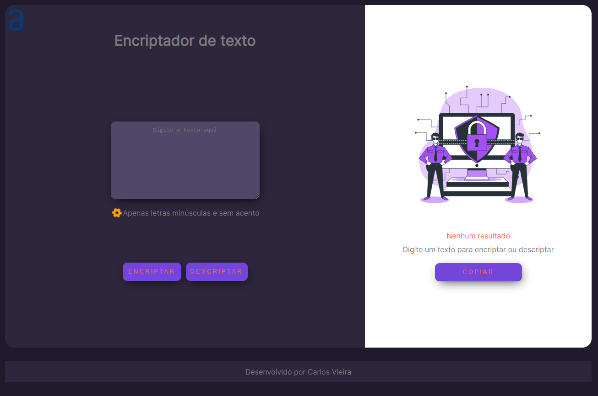

# ChallengeOne

## Decodificador de Texto

O Encriptador de Texto é um programa simples desenvolvido em HTML, CSS e JavaScript que permite encriptar e decriptar textos. Ele utiliza uma matriz de substituição para trocar letras em um texto, proporcionando uma forma de codificação básica.
E faz par

## Funcionalidades

- Encriptação de Texto: Insira um texto na caixa de entrada e clique no botão "Encriptar" para obter o texto encriptado.
- Decriptação de Texto: Insira um texto encriptado na caixa de saída e clique no botão "Decriptar" para obter o texto original.
- Normalização de Palavras: O programa realiza a normalização das palavras, garantindo que apenas letras minúsculas sem acento sejam consideradas.
- Copiar Texto: Após encriptar ou decriptar um texto, é possível copiá-lo para a área de transferência clicando no botão "Copiar".

## Intrução de uso

1. Digite um texto na caixa de entrada.
2. Clique no botão "Encriptar" para obter o texto encriptado ou clique no botão "Descriptar" para obter o texto original.
3. O texto encriptado ou decriptado será exibido na caixa de saída.
4. Para copiar o texto para a área de transferência, clique no botão "Copiar".

## Pré-requisitos

- Navegador web atualizado (recomendado: Google Chrome, Mozilla Firefox)

## Contribuição

Contribuições são bem-vindas! Sinta-se à vontade para abrir um problema ou enviar um pull request.

## Screenshots

